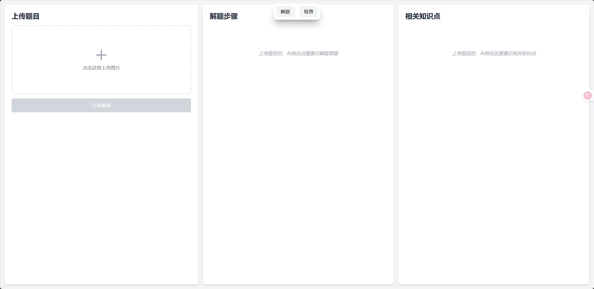

## 主要功能

* **智能解题**：
  * 用户上传数学题目图片。
  * AI 分析题目，提供详细的、分步骤的解题过程。
  * AI 针对每个解题步骤，列出相关的知识点，并解释其重要性。
* **智能验算与纠错**：
  * 用户上传包含题目和其解答过程的图片。
  * AI 分析题目和学生的解题步骤。
  * AI 判断学生答案的正确性，并标注出解题步骤中的错误之处。
  * AI 针对错误的部分，提供相关的知识点。
* **用户友好的界面**：
  * 支持图片拖拽或点击上传。
  * 清晰展示解题步骤和知识点，支持数学公式渲染。
  * 明确的错误提示和加载状态。
  * 简单的导航，方便在不同功能间切换。

## 技术栈

### 前端 (`front/`)

* **框架**: React (`^19.1.0`)
* **语言**: TypeScript (`~5.8.3`)
* **构建工具**: Vite (`^6.3.5`)
* **样式**: Tailwind CSS (`^4.1.6`)
* **数学公式渲染**: `better-react-mathjax` (`^2.3.0`)
* **代码检查**: ESLint (`^9.25.0`)

### 后端 (`back/`)

* **框架**: FastAPI (`>=0.115.12`)
* **语言**: Python `3.13`
* **AI 服务**: Google Generative AI (Gemini `gemini-2.5-flash-preview-04-17`)
* **图像处理**: Pillow (`>=11.2.1`)
* **ASGI 服务器**: Uvicorn (`>=0.34.2`)
* **依赖管理**: Poetry

## 项目结构

```
.
├── back/                 # 后端 FastAPI 应用
│   ├── src/
│   │   ├── ai/           # AI 模型交互逻辑 (solution, check, generate)
│   │   └── main.py       # FastAPI 应用入口和路由
│   ├── pyproject.toml    # Python 项目依赖 (Poetry)
│   └── ...
├── front/                # 前端 React 应用
│   ├── src/
│   │   ├── components/   # React 组件 (Solution, Check, Nav, etc.)
│   │   ├── App.tsx       # 主应用组件
│   │   └── main.tsx      # 应用入口
│   ├── vite.config.ts    # Vite 配置文件
│   ├── package.json      # Node.js 项目依赖 (pnpm)
│   └── ...
└── README.md             # 本文件
```

## 安装与启动

### 前提条件

* Node.js (推荐使用 pnpm 作为包管理器)
* Python 3.13+ (推荐使用 Poetry 管理依赖)
* Google AI API 密钥

### 后端 (`back/`)

1. **导航到后端目录**:

    ```powershell
    cd back
    ```

2. **配置环境变量**:
    创建一个 `.env` 文件在 `back/` 目录下，并添加您的 Google API 密钥:

    ```env
    GOOGLE_API_KEY="YOUR_GOOGLE_API_KEY"
    ```

3. **启动后端服务**:

    ```powershell
    uvicorn main:app --reload
    ```

    服务将在 `http://localhost:8000` 启动。

### 前端 (`front/`)

1. **导航到前端目录**:

    ```powershell
    cd front
    ```

2. **安装依赖** (使用 pnpm):

    ```powershell
    pnpm install
    ```

3. **启动前端开发服务器**:

    ```powershell
    pnpm run dev
    ```

    应用将在 `http://localhost:5173` (或 Vite 指定的其他端口) 启动，并已配置代理将 `/ai/` 请求转发到后端服务。

## 使用

1. 确保前端和后端服务都已成功启动。
2. 在浏览器中打开前端应用的地址 (默认为 `http://localhost:5173`)。
3. 通过导航栏选择“解题”或“检查”功能。
4. 上传题目图片，然后点击相应按钮开始分析。
5. 查看右侧面板展示的AI分析结果。
